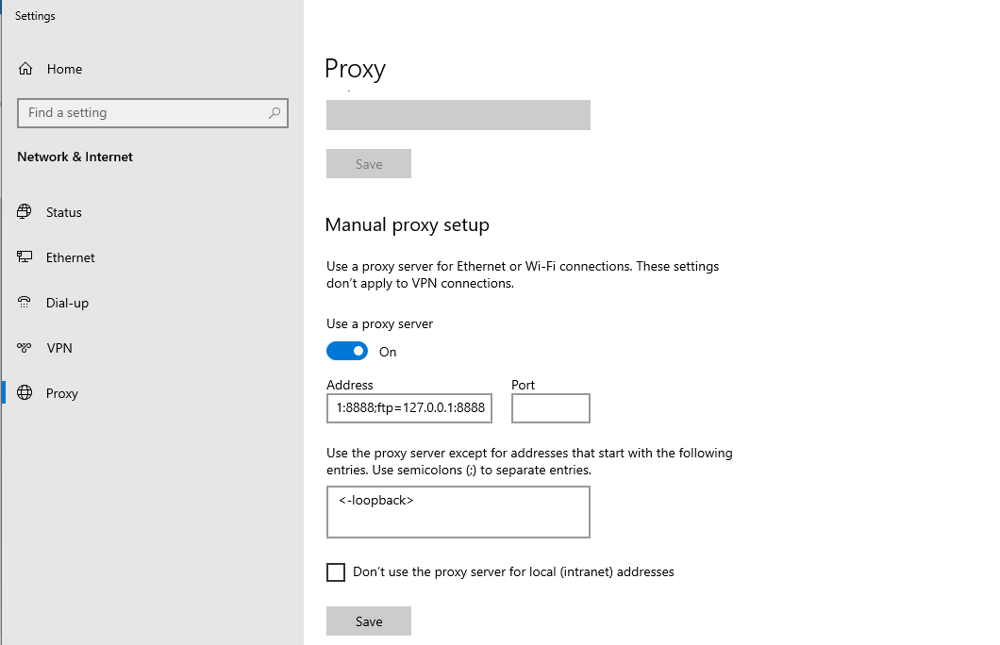
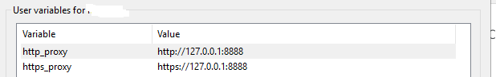
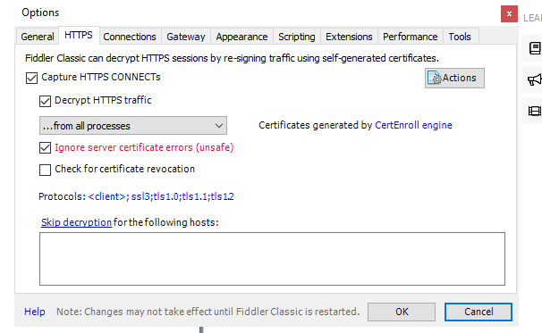

## Proxy

### Proxy set by Fiddler in Windows

```
http=127.0.0.1:8888;https=127.0.0.1:8888;ftp=127.0.0.1:8888

<-loopback>
```




### Set proxy by setting environment variables

Some applications might not respect system proxy settings. In such cases, you can try setting environment variables:

Windows:

Open Control Panel > System and Security > System.

Click "Advanced system settings" and then "Environment Variables".

Add new system variables:

```
http_proxy with value http://127.0.0.1:8888

https_proxy with value https://127.0.0.1:8888
```



macOS/Linux:

Open a terminal and enter the following commands:

```
sh
export http_proxy=http://127.0.0.1:8888
export https_proxy=https://127.0.0.1:8888
Check Firewall and Security Software:
```

Ensure your firewall or security software is not blocking Fiddler. Add an exception for Fiddler in your firewall settings.


## Capture web requests with Fiddler

[Capture web requests with Fiddler](capture%20web%20requests%20with%20Fiddler.pdf)

